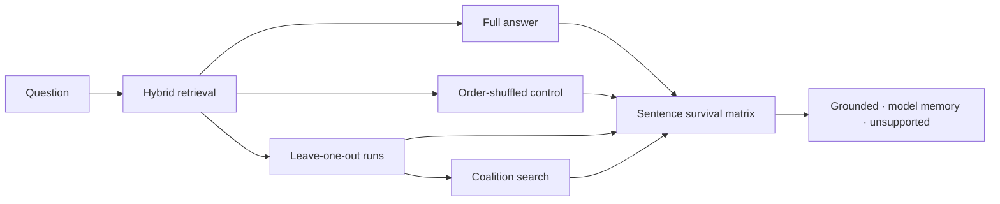

# glasshouse

[](https://github.com/mflood/glasshouse/actions/workflows/tests.yml)

**Remove the evidence. See what survives.**

Most RAG systems can show which documents they retrieved or ask the model to
generate citations. Neither proves that the model actually used those sources.
**Glasshouse tests that claim:** it removes retrieved evidence, regenerates the
answer, and measures which sentences change or disappear.

The result is an inspectable map from sentences to sources—not another citation
badge generated by the same model. It is built for AI engineers debugging RAG
pipelines, evaluating knowledge assistants, and auditing whether retrieved
context contributes to generated answers.

The included FastAPI app streams the experiment live. Hover or focus a sentence
to light up the chunks it depended on, inspect the ablation matrix, and watch
the retrieval space change as evidence is credited.

> The repository ships with a recorded run from a live model. You can clone it,
> launch the complete UI, and reproduce the published evaluations without an
> API key or a network connection.

## Try it in sixty seconds

```bash
python -m venv .venv
source .venv/bin/activate
pip install -e .
glasshouse serve --demo
```

Open `http://127.0.0.1:8000` and choose one of the six recorded questions.

To analyse your own Markdown, text, or JSONL corpus:

```bash
export ANTHROPIC_API_KEY=your-key
glasshouse serve --corpus ./documents
# or stay in the terminal
glasshouse ask --corpus ./documents "Why did the rollout slip?"
```

## Why ablation?

A source can be relevant without being used. A generated citation can look
plausible without supporting its sentence. Glasshouse asks a narrower,
falsifiable question: **if this evidence caused the claim, does the claim stop
surviving when that evidence is removed?**



The control run establishes a per-sentence noise floor so normal paraphrasing
does not masquerade as evidence. Leave-one-out runs find direct dependencies.
A bounded coalition search catches redundant evidence: when two chunks both
contain the fact, removing either one alone changes nothing, but removing both
does. That failure mode is covered by an explicit regression test.

Retrieval is hybrid reciprocal-rank fusion over lexical and dense results,
followed by MMR diversity and within-document neighbour expansion. Chunk spans
retain offsets into their source document. The language model, embedder, and
event sink all sit behind narrow Python protocols, so live calls, deterministic
tests, and the offline cassette run exactly the same pipeline.

## Does it work?

These numbers come from the committed recording and can be reproduced locally:

| Evaluation | Result | What it checks |
|---|---:|---|
| Hand-keyed attribution | **6/6** | A unique fact is credited to the one document containing it |
| Document-deletion counterfactual | **14/14** | A grounded claim changes after every credited document is independently removed |
| Independent sentence labels | **100% precision, 67% recall** | 12 hand-labelled grounded/unsupported sentences are classified without using detector verdicts as truth |
| Classification error rates | **0% FPR, 33% FNR** | The committed fixture exposes both always-grounded and never-grounded failure modes |

```bash
glasshouse eval attribution --demo
glasshouse eval counterfactual --demo
glasshouse eval injection --demo
```

The deletion counterfactual tests each attribution with a different operation
from the one that produced it. The injection command now uses a committed
fixture of independently authored positive and negative sentence labels. It
reports the full confusion matrix, and the threshold sweep optimises recall and
precision subject to a 10% false-positive-rate ceiling.

## The web surface

- **FastAPI + server-sent events.** Retrieval, generation, each ablation run,
  verdicts, and the final report arrive as separate events. Disconnecting
  cancels the analysis so an abandoned tab does not keep spending tokens.
- **Vanilla JavaScript.** One event-folded state object drives the answer,
  evidence cards, heatmap, PCA canvas, and cost meters. There is no frontend
  framework and no build step.
- **Keyboard and motion aware.** Every inspectable sentence is keyboard
  operable, focus is visible, the layout collapses for small screens, and
  reduced-motion preferences disable transitions.
- **Recorded, not mocked.** The demo cassette contains real model responses
  and usage, plus frozen embedding vectors. Replay mode refuses unrecorded
  questions rather than inventing output.

The API schema is available at `/api/docs` while the server is running.

## Limits

Glasshouse measures **dependence**, not truth. A false source can ground a false
claim, and a true claim from model memory is still not evidence from your
corpus. Results are also sensitive to retrieval misses, model nondeterminism,
sentence segmentation, and co-reference across sentences.

A full pass costs roughly one generation per retrieved chunk, plus a control,
a closed-book run, and any coalition probes. `max_runs` bounds that cost, but a
truncated run can leave claims unresolved. Coalition search is deliberately
bounded and cannot exhaust every large evidence set. The UI exposes runs,
tokens, dollars, noise floors, and unresolved verdicts rather than hiding those
trade-offs.

## Development

```bash
pip install -e '.[dev]'
pytest
```

The suite covers chunk offsets, hybrid retrieval and neighbour boundaries,
retry policy, SSE ordering and cancellation, verdict thresholds, recorded
replay, evaluation logic, and the redundant-evidence case where ordinary
leave-one-out attribution fails.

Apache-2.0 licensed.
